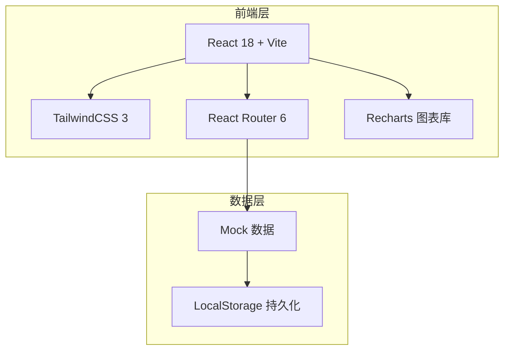
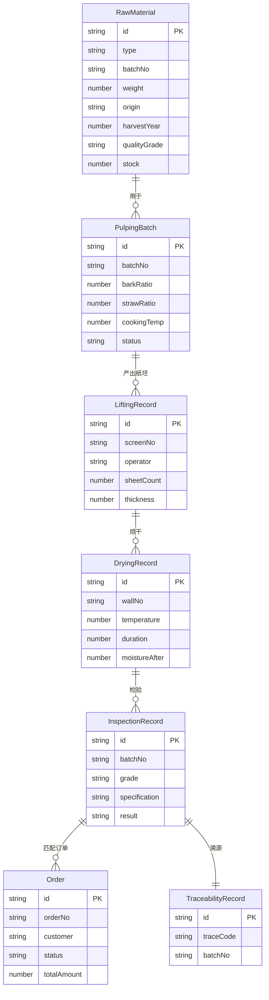

## 1. 架构设计



## 2. 技术说明

- 前端：React@18 + TailwindCSS@3 + Vite
- 初始化工具：Vite (vite-init)
- 后端：无（纯前端，Mock数据模拟）
- 数据库：无（LocalStorage + 内存状态管理）
- 图表库：Recharts（用于库存图表、温度曲线、产量统计等）
- 路由：React Router v6

## 3. 路由定义

| 路由 | 用途 |
|------|------|
| / | 首页仪表盘，展示生产概览与关键指标 |
| /materials | 原料管理页面：青檀皮/稻草原料入库、库存、质检 |
| /pulping | 制浆工序页面：燎草制浆记录、配浆比例管理 |
| /lifting | 捞纸生产页面：帘床管理、捞纸操作、产量统计 |
| /drying | 晒纸焙干页面：火墙晒纸管理、温度监控 |
| /inspection | 检验分级页面：成纸检验、规格分级、检验报告 |
| /orders | 订单生产页面：书画用纸订单、文房四宝供应、生产排期 |
| /traceability | 销售溯源页面：批次溯源、销售台账、工艺传承档案 |

## 4. API定义

无后端API，使用前端Mock数据。核心数据结构定义如下：

```typescript
interface RawMaterial {
  id: string;
  type: "青檀皮" | "稻草";
  batchNo: string;
  weight: number;
  origin: string;
  harvestYear: number;
  qualityGrade: string;
  stock: number;
  entryDate: string;
  supplier: string;
}

interface PulpingBatch {
  id: string;
  batchNo: string;
  materialIds: string[];
  barkRatio: number;
  strawRatio: number;
  cookingTemp: number;
  cookingTime: number;
  cookingPressure: number;
  beatingDegree: number;
  status: "制浆中" | "已完成" | "质检中";
  operator: string;
  startDate: string;
  endDate?: string;
}

interface LiftingRecord {
  id: string;
  screenNo: string;
  operator: string;
  sheetCount: number;
  thickness: number;
  paperBlankIds: string[];
  date: string;
}

interface DryingRecord {
  id: string;
  wallNo: string;
  batchNo: string;
  temperature: number;
  humidity: number;
  duration: number;
  moistureAfter: number;
  operator: string;
  startDate: string;
  endDate: string;
}

interface InspectionRecord {
  id: string;
  batchNo: string;
  tensileStrength: number;
  thicknessUniformity: number;
  lightTransmittance: number;
  inkAbsorption: number;
  grade: "特皮" | "净皮" | "棉料";
  specification: "四尺" | "六尺" | "八尺" | "丈二";
  result: "合格" | "不合格";
  inspector: string;
  date: string;
}

interface Order {
  id: string;
  orderNo: string;
  customer: string;
  items: OrderItem[];
  status: "待排产" | "生产中" | "已完成" | "已发货";
  deliveryDate: string;
  totalAmount: number;
  createDate: string;
}

interface OrderItem {
  specification: string;
  grade: string;
  quantity: number;
  unitPrice: number;
}

interface TraceabilityRecord {
  id: string;
  traceCode: string;
  batchNo: string;
  materialInfo: string;
  pulpingInfo: string;
  liftingInfo: string;
  dryingInfo: string;
  inspectionInfo: string;
  saleInfo: string;
}
```

## 5. 服务器架构图

无后端服务器，纯前端架构。

## 6. 数据模型

### 6.1 数据模型定义



### 6.2 数据定义语言

使用前端Mock数据，无需DDL。
